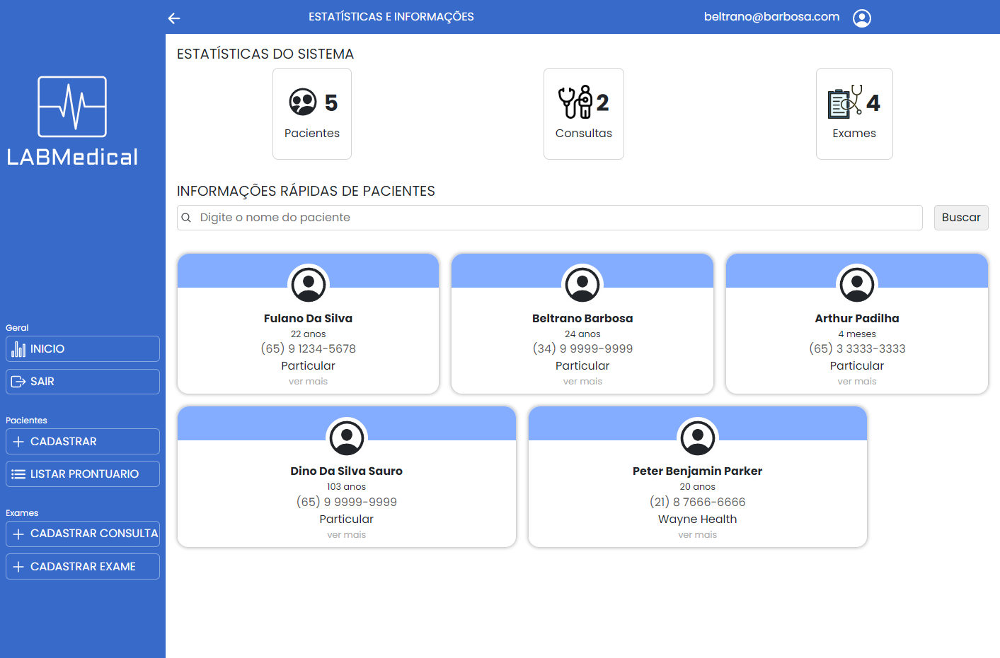

# API Médica

### Quais problemas ele(a) resolve ?
*A API Médica visa simplificar a criação e manutenção de um cadastro de pacientes com suas respectivas consultas e exames, podendo ser facilmente gerenciada e melhorada conforme necessidade.*

### Tecnologias utilizadas

#### Framewok
- [Vite](https://vitejs.dev/) - é um servidor de desenvolvimento local para front-end

#### Dependências
- [bootstrap](https://getbootstrap.com/)
- [json-server](https://www.npmjs.com/package/json-server)
- [react](https://react.dev/)
- [react-bootstrap](https://react-bootstrap.netlify.app/)
- [react-dom](https://pt-br.legacy.reactjs.org/docs/react-dom.html)
- [react-hook-form](https://www.react-hook-form.com/)
- [react-icons](https://react-icons.github.io/react-icons/)
- [react-input-mask](https://www.npmjs.com/package/react-input-mask)
- [react-router-dom](https://reactrouter.com/en/main)
- [styled-components](https://styled-components.com/)

### Como executar o projeto
1. Abra o terminal do seu sistema operacional e navegue para o diretório onde deseja que o repositório seja clonado.
2. Digite o comando: `git clone https://github.com/rpad88/projeto-avaliativo-mod2.git`
3. Aguarde até que o repositório seja clonado no seu sistema local.
6. Após a conclusão, acesse a pasta do repositório.
5. Instale as dependências `npm install`
6. Rode o sistema com o comando: `npm run dev`

### Melhorias
- agendamento de consultas e exames
- confirmação de agendamento por SMS ou WhatsApp